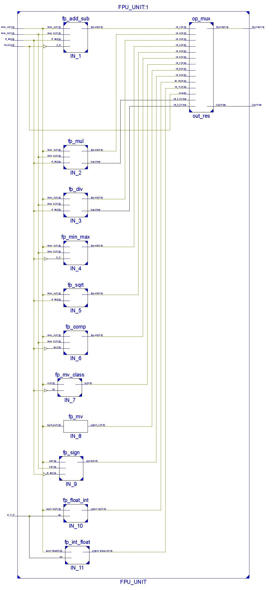

# Note: 
> This FPU Implementation is Fully Combinational

# FPU Instructions
Instructions supported by FPU Unit:

> Floating-Point Load and Store Instructions:
 - flw: Floating-point Load Word
 - fsw: Floating-point Store Word

> Floating-Point Computational Instructions:
 - fadd.s: Floating-point Add (single precision)
 - fsub.s: Floating-point Subtract (single precision)
 - fmul.s: Floating-point Multiply (single precision)
 - fdiv.s: Floating-point Divide (single precision)
 - fsqrt.s: Floating-point Square Root (single precision)

> Floating-Point Sign Instructions:
 - fsgnj.s: Floating-point Sign Injection 
 - fsgnjn.s: Floating-point Sign Injection Negate 
 - fsgnj.s: Floating-point Sign Injection Xor 

> Floating-Point Conversion Instructions:
 - fmv.x.w: Floating-point Move to Integer (word)
 - fmv.w.x: Floating-point Move from Integer (word)
 - fcvt.w.s: Floating-point Convert to Signed Integer (32-bit)
 - fcvt.wu.s: Floating-point Convert to Unsigned Integer (32-bit)
 - fcvt.s.w: Floating-point Convert to Single Precision from Signed Integer (32-bit)
 - fcvt.s.wu: Floating-point Convert to Single Precision from Unsigned Integer (32-bit)
 - fclass.s: Classifiy the Floating point

> Floating-Point Comparison Instructions:
 - fmin.s: Floating-point Minimum (single precision)
 - fmax.s: Floating-point Maximum (single precision)
 - feq.s: Floating-point Equal (single precision)
 - flt.s: Floating-point Less Than (single precision)
 - fle.s: Floating-point Less Than or Equal (single precision)

# Microarchitecture:

# Load And Store Module

- Workflow:
 - flw (load word instruction for floating-point words):
  - reads the word in the memory of address specified by the offset in the immediate field and the content of the integer register of address specified by the content of rs1.
  - Writes this word in floating-point register of address specified by the content of rd field.

 - fsw (store word instruction for floating-point words): 
  - reads the word in the floating-point register of address specified by the content of rs2.
  - Writes this word in the memory of address specified by the offset in the immediate field and rd field, and the content of the integer register of address specified by the content of rs1.

# Sign Module

- Workflow:

